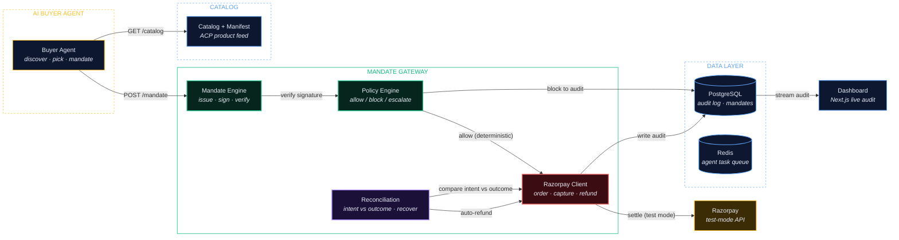
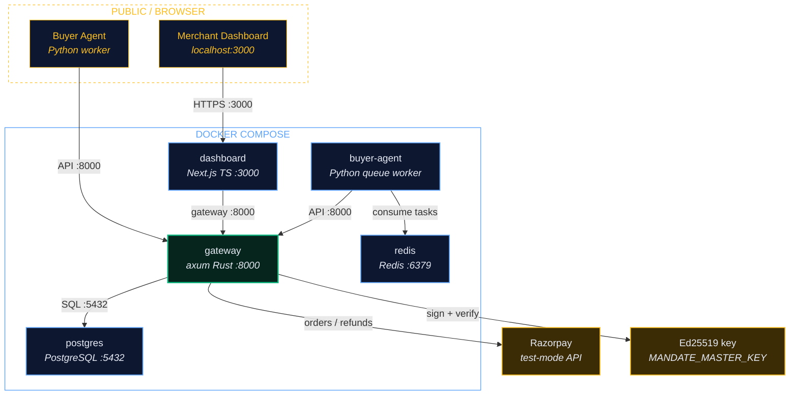

# Architecture

## Trust Flow

## System Stack

## Components

| Component | Crate | Purpose |
|---|---|---|
| Mandate Engine | `gateway/crates/mandate-engine` | Ed25519 signing, verification, nonce replay protection |
| Policy Engine | `gateway/crates/policy-engine` | Deterministic allow/block/escalate, zero AI dependencies |
| Razorpay Client | `gateway/crates/razorpay-client` | Orders, Payments, Refunds API (test mode) |
| Catalog Service | `gateway/services/catalog-service` | Unified gateway server, 21 API routes |
| Reconciliation | `gateway/services/reconciliation` | Intent vs outcome mismatch detection and auto refund |
| Dashboard | `dashboard/` | Next.js 14 merchant app, 13 pages |
| Buyer Agent | `buyer-agent/` | Python queue worker, self drives every 30s |
